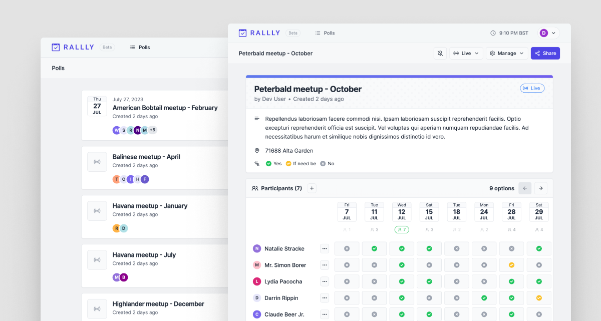

<!--
N.B.: This README was automatically generated by <https://github.com/YunoHost/apps/tree/master/tools/readme_generator>
It shall NOT be edited by hand.
-->

# Rallly for YunoHost

[](https://dash.yunohost.org/appci/app/rallly)  

[](https://install-app.yunohost.org/?app=rallly)

*[Read this README in other languages.](./ALL_README.md)*

> *This package allows you to install Rallly quickly and simply on a YunoHost server.*  
> *If you don't have YunoHost, please consult [the guide](https://yunohost.org/install) to learn how to install it.*

## Overview

Schedule group meetings with friends, colleagues and teams. Create meeting polls to find the best date and time to organize an event based on your participants' availability.

**Shipped version:** 3.8.0~ynh1

**Demo:** <https://app.rallly.co/polls>

## Screenshots



## Documentation and resources

- Official app website: <https://rallly.co/fr>
- Official admin documentation: <https://support.rallly.co/introduction>
- Upstream app code repository: <https://github.com/lukevella/rallly>
- YunoHost Store: <https://apps.yunohost.org/app/rallly>
- Report a bug: <https://github.com/YunoHost-Apps/rallly_ynh/issues>

## Developer info

Please send your pull request to the [`testing` branch](https://github.com/YunoHost-Apps/rallly_ynh/tree/testing).

To try the `testing` branch, please proceed like that:

```bash
sudo yunohost app install https://github.com/YunoHost-Apps/rallly_ynh/tree/testing --debug
or
sudo yunohost app upgrade rallly -u https://github.com/YunoHost-Apps/rallly_ynh/tree/testing --debug
```

**More info regarding app packaging:** <https://yunohost.org/packaging_apps>
